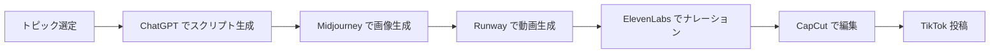

# AI×TikTokアフィリエイト完全攻略ガイド

## 講座概要

**実績**: 初月18万円達成
**対象**: 初心者向け
**テーマ**: AI×TikTokを活用したアフィリエイト副業

---

## 📑 目次

1. [イントロダクション](#1-イントロダクション)
2. [AI×TikTokアフィリエイトとは](#2-aitiktokアフィリエイトとは)
3. [必要な準備](#3-必要な準備)
4. [実践ステップ](#4-実践ステップ)
5. [AIの活用方法](#5-aiの活用方法)
6. [収益化のポイント](#6-収益化のポイント)
7. [成功のための戦略](#7-成功のための戦略)
8. [よくある質問](#8-よくある質問)
9. [まとめ](#9-まとめ)

---

## 1. イントロダクション

### 🎯 この講座で学べること

- ✅ AIツールを使った効率的なコンテンツ作成
- ✅ TikTokでのバイラル戦略
- ✅ アフィリエイト収益の最大化手法
- ✅ 初月から成果を出すための実践ノウハウ

### 📊 実績紹介

- **初月収益**: 18万円
- **使用期間**: 1ヶ月
- **投資額**: 最小限（ツール利用料のみ）

---

## 2. AI×TikTokアフィリエイトとは

### 🤖 仕組みの説明

```
[AIツール] → [コンテンツ生成] → [TikTok投稿] → [視聴者] → [アフィリエイトリンク] → [収益]
```

### 💡 なぜ今注目されているのか

1. **TikTokの急成長**
   - 月間アクティブユーザー: 10億人超
   - 高いエンゲージメント率
   - 若年層を中心に拡大中

2. **AIツールの進化**
   - 高品質なコンテンツを短時間で生成
   - 専門知識不要
   - コスト削減

3. **アフィリエイトとの親和性**
   - 短尺動画で商品紹介
   - 購買意欲の高いユーザー層
   - 即座のアクション促進

---

## 3. 必要な準備

### 📱 アカウント準備

#### TikTokアカウント
- [ ] TikTokアカウント作成
- [ ] プロフィール最適化
- [ ] ビジネスアカウントへ切り替え

#### アフィリエイトプログラム
- [ ] ASP（アフィリエイトサービスプロバイダー）登録
  - A8.net
  - もしもアフィリエイト
  - Amazonアソシエイト
  - 楽天アフィリエイト

### 🛠️ 必要なツール

#### AIツール
1. **動画生成AI**
   - Runway
   - Pika Labs
   - Synthesia

2. **テキスト生成AI**
   - ChatGPT
   - Claude
   - Gemini

3. **画像生成AI**
   - Midjourney
   - DALL-E 3
   - Stable Diffusion

4. **音声生成AI**
   - ElevenLabs
   - VOICEVOX

#### 編集ツール
- CapCut（動画編集）
- Canva（サムネイル作成）

### 💰 初期投資

| 項目 | 金額 | 必須度 |
|------|------|--------|
| AIツール利用料 | 月2,000〜5,000円 | ◎ |
| 編集ソフト | 無料〜 | ◎ |
| スマートフォン | 既存のもの | ◎ |
| 撮影機材 | 0〜10,000円 | △ |

**合計**: 約2,000〜15,000円/月

---

## 4. 実践ステップ

### ステップ1: ニッチ選定

#### 選定基準
1. **需要があるか**
   - トレンド調査
   - ハッシュタグ分析

2. **競合は少ないか**
   - 競合アカウント調査
   - 差別化ポイント確認

3. **収益性は高いか**
   - アフィリエイト報酬単価
   - CVR（成約率）

#### おすすめニッチ
- 美容・スキンケア
- ダイエット・フィットネス
- ガジェット・テック
- 学習・自己啓発
- 金融・投資

### ステップ2: コンテンツ企画

#### バイラルコンテンツの要素
1. **フック（最初の3秒）**
   - 衝撃的な事実
   - 疑問形のタイトル
   - Before/After比較

2. **ストーリーライン**
   - 問題提起
   - 解決策の提示
   - CTA（行動喚起）

3. **視覚的魅力**
   - 高画質
   - テンポの良い編集
   - トレンド音源

#### コンテンツフォーマット例

**フォーマット1: 商品レビュー**
```
1. 商品の紹介（5秒）
2. 使用感のデモ（10秒）
3. メリット・デメリット（10秒）
4. 購入リンク案内（5秒）
```

**フォーマット2: ハウツー**
```
1. 問題提起（3秒）
2. 解決手順（20秒）
3. 結果の提示（5秒）
4. 詳細リンク案内（2秒）
```

**フォーマット3: リスト形式**
```
1. タイトル「○○選」（3秒）
2. 各項目の紹介（各5秒）
3. まとめ（5秒）
4. リンク案内（2秒）
```

### ステップ3: AI活用でコンテンツ生成

#### 3-1. スクリプト作成（ChatGPT）

**プロンプト例**:
```
TikTok向けの30秒の商品紹介スクリプトを作成してください。

【商品】: ワイヤレスイヤホン XYZ
【ターゲット】: 20-30代の通勤者
【訴求ポイント】: ノイズキャンセリング、長時間バッテリー
【トーン】: カジュアルで親しみやすい

以下の構成で：
1. フック（最初の3秒で注目を集める）
2. 商品の特徴（15秒）
3. 使用シーン（10秒）
4. CTA（2秒）
```

#### 3-2. 動画素材生成（Runway/Pika）

**生成例**:
- 商品使用シーン
- Before/After比較
- 効果のビジュアル化

#### 3-3. ナレーション生成（ElevenLabs）

**設定のポイント**:
- 明るく親しみやすい声
- 適度な速度（通常の1.1倍程度）
- 感情表現を豊かに

#### 3-4. BGM・効果音

**おすすめソース**:
- TikTok内のトレンド音源
- Epidemic Sound
- Artlist

### ステップ4: 動画編集

#### CapCutでの編集フロー

1. **素材の配置**
   - AIで生成した動画素材
   - テキストオーバーレイ
   - トランジション

2. **テキスト追加**
   - 字幕（必須）
   - キーワード強調
   - CTAボタン

3. **エフェクト適用**
   - トレンドエフェクト
   - ズーム/カット
   - スローモーション

4. **最終調整**
   - 色補正
   - 音量バランス
   - 長さ調整（30-60秒）

### ステップ5: 投稿戦略

#### 最適な投稿時間
- **平日**: 19:00-22:00
- **休日**: 10:00-12:00、19:00-23:00

#### ハッシュタグ戦略
```
#おすすめ商品 #便利グッズ #買ってよかった
#Amazon購入品 #コスパ最強 #ガジェット好き
#TikTok売れ #バズり商品
```

**ポイント**:
- トレンドタグ（2-3個）
- ニッチタグ（3-4個）
- ブランドタグ（1-2個）

#### 投稿頻度
- **理想**: 1日2-3投稿
- **最低**: 1日1投稿
- **継続期間**: 最低30日

### ステップ6: 分析・改善

#### 重要指標（KPI）

| 指標 | 目標値 | 改善アクション |
|------|--------|----------------|
| 視聴完了率 | 70%以上 | フックの改善、テンポアップ |
| いいね率 | 5%以上 | コンテンツの価値向上 |
| シェア率 | 2%以上 | 共感性の強化 |
| CTR | 3%以上 | CTAの最適化 |
| CVR | 1%以上 | ランディングページ改善 |

#### A/Bテスト項目
- サムネイル画像
- タイトル文言
- 投稿時間
- ハッシュタグ組み合わせ
- BGM選択

---

## 5. AIの活用方法

### 🎨 コンテンツ生成の自動化

#### ワークフロー例



### 💡 効率化のコツ

1. **テンプレート化**
   - プロンプトをテンプレート化
   - 編集プリセットを保存
   - ハッシュタグセットを準備

2. **バッチ処理**
   - 1週間分のスクリプトを一括生成
   - 素材を事前に大量生成
   - 予約投稿機能の活用

3. **品質管理**
   - AIの出力を必ずチェック
   - ブランドトーンの統一
   - 定期的な見直し

---

## 6. 収益化のポイント

### 💰 収益構造

#### 収益源
1. **アフィリエイト報酬** (メイン)
2. **TikTokクリエイター報酬** (サブ)
3. **企業案件** (中長期)

#### 月間収益シミュレーション

**条件**:
- フォロワー: 5,000人
- 平均視聴回数: 10,000回/動画
- 投稿数: 60本/月
- CTR: 3%
- CVR: 1%
- 平均報酬単価: 1,000円

**計算**:
```
月間総視聴: 10,000回 × 60本 = 600,000回
クリック数: 600,000 × 3% = 18,000クリック
成約数: 18,000 × 1% = 180件
収益: 180件 × 1,000円 = 180,000円
```

### 📈 収益を最大化する戦略

#### 1. 高単価商品の選定
- 報酬単価: 1,000円以上
- リピート率が高い商品
- トレンド商品

#### 2. ランディングページの最適化
- 魅力的な商品説明
- 購入障壁の除去
- 限定オファー

#### 3. フォロー導線の設計
- プロフィールの最適化
- リンクツリーの活用
- 特典の提供

---

## 7. 成功のための戦略

### 🎯 差別化戦略

#### 独自性の出し方
1. **キャラクター設定**
   - 専門家ポジション
   - ユニークな視点
   - 親しみやすいキャラ

2. **コンテンツの質**
   - より詳細な情報
   - オリジナルの検証
   - ビジュアルの工夫

3. **スピード**
   - トレンドへの即応
   - 定期的な投稿
   - レスポンスの速さ

### 🚀 成長戦略

#### フェーズ1: 基盤構築（0-1ヶ月）
- [ ] アカウント設定完了
- [ ] 30本の動画投稿
- [ ] フォロワー1,000人達成

#### フェーズ2: 拡大（1-3ヶ月）
- [ ] 100本の動画投稿
- [ ] フォロワー10,000人達成
- [ ] 初収益化達成

#### フェーズ3: 最適化（3-6ヶ月）
- [ ] データ分析に基づく改善
- [ ] 収益の安定化
- [ ] 月間30万円達成

### ⚠️ 注意点・リスク

#### コンプライアンス
- [ ] 薬機法・景表法の遵守
- [ ] ステマ規制の理解
- [ ] 著作権の確認

#### プラットフォームリスク
- [ ] アカウント凍結対策
- [ ] 複数プラットフォームへの展開
- [ ] コミュニティガイドライン遵守

---

## 8. よくある質問

### Q1: 完全初心者でも始められますか？
**A**: はい、可能です。このガイドでは初心者でも実践できるよう、段階的な手順を示しています。

### Q2: どれくらいの時間が必要ですか？
**A**: 1日2-3時間の作業で、週15-20時間程度が目安です。AIツールを活用することで効率化できます。

### Q3: 初期費用はどれくらいかかりますか？
**A**: 月2,000-15,000円程度です。無料ツールを中心に使えば、最小限の投資で始められます。

### Q4: 収益化までどれくらいかかりますか？
**A**: 早い人で2週間、平均で1-2ヶ月程度です。継続的な投稿と改善が重要です。

### Q5: スマホだけで完結できますか？
**A**: はい、スマホアプリだけでも可能です。ただし、PCがあるとより効率的です。

### Q6: どのジャンルがおすすめですか？
**A**: 自分が興味があり、かつ需要のあるジャンルを選びましょう。美容、ガジェット、学習系が人気です。

### Q7: 顔出しは必要ですか？
**A**: いいえ、必須ではありません。AIアバターやテキスト動画でも十分に成果を出せます。

### Q8: TikTok以外のプラットフォームでも使えますか？
**A**: はい、Instagram ReelsやYouTube Shortsでも同じ手法が応用できます。

---

## 9. まとめ

### ✅ 成功の3つの柱

1. **継続性**
   - 毎日の投稿習慣
   - 長期的な視点
   - 諦めない心

2. **分析と改善**
   - データドリブンな意思決定
   - PDCAサイクルの実践
   - 柔軟な戦略変更

3. **価値提供**
   - 視聴者ファースト
   - 本当に良い商品の紹介
   - 誠実なコミュニケーション

### 🎯 次のアクション

今日から始められること：
- [ ] TikTokアカウントの作成
- [ ] ASPへの登録
- [ ] AIツールの無料トライアル
- [ ] 最初の動画企画を考える
- [ ] 1本目の動画を投稿する

### 📚 さらに学ぶために

- TikTokクリエイターアカデミー
- アフィリエイト関連書籍
- AI活用事例の研究
- 成功者のアカウント分析

---

## 📞 サポート・コミュニティ

### リソース
- 公式Discord（コミュニティ）
- 月次オンラインセミナー
- Q&Aセッション
- 個別コンサルティング

---

**動画リンク**: https://www.youtube.com/watch?v=gNc-FSfBDcA

**作成日**: 2025年11月2日

---

## 付録: チェックリスト

### 開始前チェックリスト
- [ ] TikTokアカウント作成完了
- [ ] ASP登録完了
- [ ] AIツール準備完了
- [ ] 編集ツールインストール完了
- [ ] ニッチ選定完了
- [ ] コンテンツプラン作成完了

### 毎日のチェックリスト
- [ ] 新しい動画を1本投稿
- [ ] コメントへの返信
- [ ] トレンド調査
- [ ] データ分析（週1回以上）
- [ ] 改善アクションの実施

### 月次チェックリスト
- [ ] 月間収益の確認
- [ ] KPI達成度の確認
- [ ] 次月の戦略立案
- [ ] ツール・リソースの見直し
- [ ] スキルアップのための学習

---

**免責事項**: 本ガイドは教育目的で作成されています。実際の収益は個人の努力や市場環境により異なります。法令遵守の上、倫理的な運用を心がけてください。
